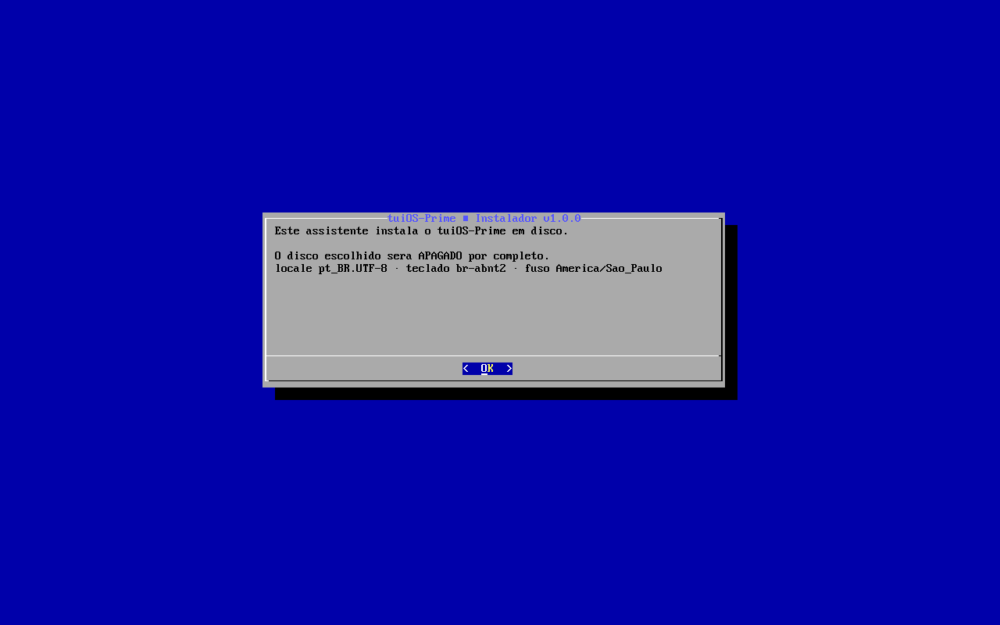
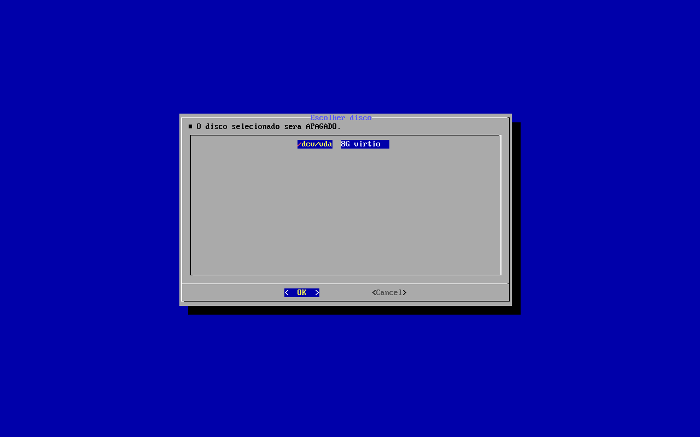
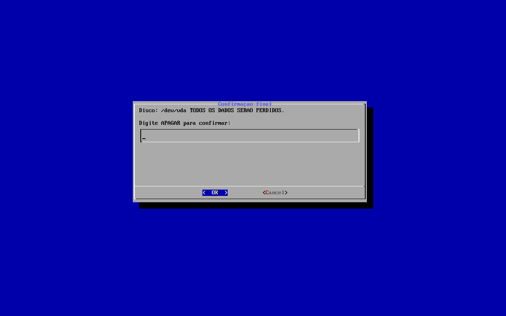
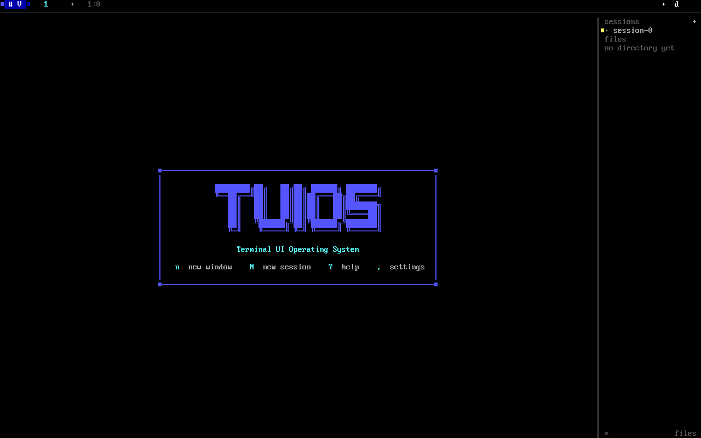

# tuiOS-Prime

> **Um sistema operacional que você boota e ele já começa a se instalar.**
> Kernel Rust bare-metal + ISO NixOS reprodutível + assistente em PT-BR.

[](https://github.com/peder1981/tuiOS-Prime/actions)
[](LICENSE)
[](https://www.rust-lang.org/tools/nightly)
[](https://nixos.org/)
[](https://github.com/peder1981/AdvPP)
[](https://www.qemu.org/)

Pendrive no PC, `Ctrl+U` no Chromebook — e **o instalador abre sozinho**,
te guia em 5 etapas em português, e o tuiOS assume em seguida. Sem digitar
um único comando. Quer ver?

## 🖼️ O tuiOS na prática

Todos os prints abaixo são **reais**, capturados do QEMU durante os testes
automatizados deste repositório:

**1. Bootou? O assistente já está na tela:**



**2. Escolha o disco — ele lista o que existe:**



**3. Segurança em primeiro lugar — nada é apagado sem você digitar a
palavra-chave `APAGAR`:**



**4. Cancelou? A sessão tuiOS está lá, pronta para uso:**



> 📸 Todos estes prints foram gerados por `just test-install`/QEMU e
> verificados pixel-a-pixel — zero de imagem editada.

## ✨ Por que experimentar?

- **🖥️ Instalação guiada em PT-BR** — 5 etapas com diálogo interativo;
  também existe modo automático (`--auto`) para CI
- **🦀 Kernel Rust do zero** — `no_std`, boot UEFI/Limine, drivers
  virtio/AHCI/write
- **🔁 ISO 100% reprodutível** — Nix, mesma entrada → mesmo bit
- **🧠 AdvPP embarcado (v4.4.0)** — compilador AdvPL/TLPP (`advplc`)
  pronto para uso: `advplc run programa.prw`
- **🐧 Base NixOS** — você tem um sistema GNU/Linux completo por baixo,
  com NetworkManager, git, vim e Go instalados

## 🚀 Rodar agora (QEMU)

```bash
git clone https://github.com/peder1981/tuiOS-Prime.git
cd tuiOS-Prime

just iso            # gera a ISO (Nix)
just qemu-iso       # boota a ISO no QEMU

# Alternativas de desenvolvimento do kernel:
just qemu-kernel    # kernel bare-metal direto
just qemu-fase1     # kernel com rede
```

Pré-requisitos: [Nix](https://nixos.org/download.html) + QEMU 8.2+ com KVM.

## 💾 Instalar no disco (Chromebook/PC)

```bash
just iso                                                          # 1. build da ISO
sudo dd if=result/iso/nixos-*.iso of=/dev/sdX bs=4M status=progress conv=fsync  # 2. gravar pendrive
# 3. bootar pelo pendrive — o assistente abre SOZINHO (print 1 acima)
```

- Prefere manual? Cancele o assistente e rode `tuios-instalar` quando quiser
- Instalação automatizada (testes/CI): `tuios-instalar --auto --disco /dev/vda --sem-rede --aceitar-tudo`
- Guia completo: [docs/instalacao/instalar.md](docs/instalacao/instalar.md)
- Teste de ponta a ponta: `just test-install` (instala no QEMU e boota o disco)

## 🧠 AdvPP: AdvPL/TLPP embarcado

O tuiOS-Prime vem com o compilador **[AdvPP](https://github.com/peder1981/AdvPP)
v4.4.0** — desenvolva e execute código AdvPL/TLPP direto no sistema:

```bash
advplc run programa.prw      # compila e executa
advplc check programa.prw    # valida sintaxe
advplc build programa.prw    # gera executável standalone
advplc serve programa.prw    # roda em modo web
```

Mais detalhes: [docs/instalacao/advpp-integracao.md](docs/instalacao/advpp-integracao.md).

## 📋 Suporte a Chromebook

O tuiOS-Prime é otimizado para Chromebooks com hardware limitado:

| Perfil | CPU | RAM | Uso |
|--------|-----|-----|-----|
| **Minimal** | Intel Atom/Celeron | 2-4GB | Kernel + shell + rede |
| **Standard** | Intel Core m/Pentium | 4-8GB | Kernel + drivers completos |
| **Performance** | Intel Core i5/i7 | 8GB+ | Kernel + desenvolvimento |

## 📁 Estrutura

```
tuiOS-Prime/
├── kernel/           # Kernel Rust bare-metal
├── nixos/            # ISO NixOS, sessão tuiOS, pacote advplc
├── installer/        # Assistente tuios-instalar (PT-BR)
├── shared/           # Scripts de build
├── scripts-assert/   # Testes automatizados (8 asserts + QEMU)
├── docs/             # Documentação
│   ├── imagens/      # Prints reais usados neste README
│   ├── instalacao/   # Guias de instalação
│   ├── hardware/     # Compatibilidade
│   └── contribuicao/ # Guia para contribuidores
└── README.md
```

## 📊 Status

| Componente | Status |
|------------|--------|
| Boot UEFI/Limine | ✅ |
| Heap dinâmica | ✅ |
| Shell interativa | ✅ |
| Driver virtio-blk | ✅ |
| FAT32 read-only | ✅ |
| Driver e1000 | ✅ (TX) |
| Driver AHCI | ✅ |
| Rede (RX) | 🔄 Em desenvolvimento |
| Instalador PT-BR (5 etapas) | ✅ |
| Assistente auto-abre no boot | ✅ |
| AdvPP v4.4.0 embarcado | ✅ |
| Testes QEMU no CI | ✅ |

## 🤝 Contribuindo

Veja [docs/contribuicao/guia-contribuicao.md](docs/contribuicao/guia-contribuicao.md) para detalhes.

## 📄 Licença

MIT — Veja [LICENSE](LICENSE) para detalhes.

---

**Desenvolvido com ❤️ em português brasileiro**
